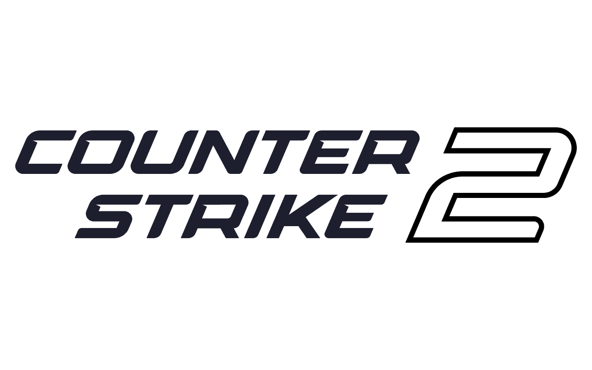

<div align="center">
    
</div>

<div align="center">
    <h1>CS2 Advanced Movement Config</h1>
</div>

This is a post-patch movement config for Counter-Strike 2 that enables easier execution of advanced movement techniques like bunnyhopping, long jumps, and jump-bugs.

## Credits

This configuration was created by **ruby rain**. You can find them on Steam: [steamcommunity.com/id/r_by](https://steamcommunity.com/id/r_by)

## Features

The script provides several aliases for different movement types:

*   `+j`: Simple jump.
*   `+jb`: Jump-bug.
*   `+lj`: Long-jump.
*   `+ljleft`: Long-jump with a left strafe.
*   `+ljright`: Long-jump with a right strafe.
*   `+mj`: Crouch-jump.
*   `j`: Single tick jump.
*   `jb`: Single tick jump-bug.

## Prerequisites

*   **`sv_cheats 1` must be enabled on the server.** You can only use the exec-async command with sv_cheats enabled, on Valve Match Making you can only use normal exec in setup.cfg.

## The August 2nd CS2 Update

Valve decided to merge the beta branch featuring bhopping fix, reduce the interval of velocity penalty. By limiting your fps to 64 using the fps_max 64 in CS2's console command, you can archieve 100% perf bhop, making bhop very consistent with velocity around 290-300 unit max (300 is the hard cap of movement speed). Ruby Rain's config provide a de-subticked jump bind, this furthur enhance the chance of hitting perf.

## Installation

1.  Locate your CS2 `cfg` directory. It's usually found at:
    `C:\Program Files (x86)\Steam\steamapps\common\Counter-Strike Global Offensive\game\csgo\cfg`

2.  Copy the `movement` folder and `autoexec.cfg` from this repository into your `cfg` directory.

3.  If you already have an `autoexec.cfg`, open it and add the following line to the end:
    ```
    exec movement/setup
    ```
    You should also copy the keybinds from the provided `autoexec.cfg` or create your own.

## Default Key Bindings

| Key | Alias | Description |
|-----|-------|-------------|
| `Alt` | fps_max 200 64 | Toggle between 200 and 64 fps | 
| `mouse4` | `+lj` | Long-jump |
| `mouse5` | `+jb` | Jump-bug |
| `mwheeldown` | `+jump_` | Enhanced jump (scroll down) |
| `mwheelup` | `+jump_` | Enhanced jump (scroll up) |

You can bind your desired keys to the aliases provided by the script. The script is activated by holding down a key bound to one of the `+` aliases (e.g., `+lj`) and is deactivated upon release.

Here are the example binds from `autoexec.cfg`:

```cfg
bind "mouse4" "+lj"
bind "mouse5" "+jb"
bind "mwheeldown" "+jump_"
bind "mwheelup" "+jump_"
```

You can add these to your `autoexec.cfg` or another config file and change the keys to your preference.

## Important Note

The script's functionality may stop working after about 6 hours of gameplay. If you notice it's not working anymore, you need to re-execute the script by typing `exec movement/setup` in the console while in the main menu or lobby.
